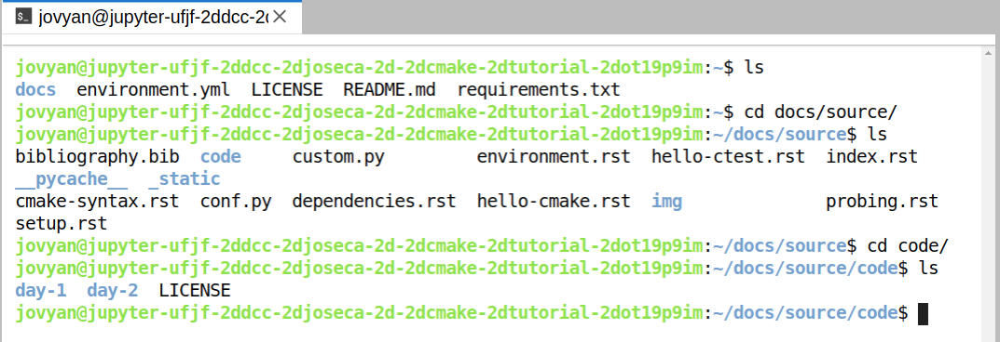

Configurando seu sistema
==========================

Para acompanhar este tutorial, você precisará ter acesso a compiladores,
Python e CMake.  Veremos algumas instruções de como instalar os pré-requisitos
em seu próprio computador. Veremos também como usar o `Binder
<https://mybinder.org>`_ para rodar na nuvem.

Estas instruções são baseadas na instalação de compiladores e CMake através 
do `gerenciador de pacotes e ambientes Conda <https://docs.conda.io/en/latest/>`_, uma vez que
fornece uma maneira conveniente para instalar pacotes binários em um ambiente de software isolado.

Para usuários Windows
^^^^^^^^^^^^^^^^^^^^^^

É fortemente recomendável usar (e instalar, se necessário) o Windows
Subsystem for Linux (WSL), pois é uma ferramenta poderosa que provavelmente
também será útil após a finalização desse tutorial. Dentro do WSL você precisará do Python3
e o gerenciamento de ambiente conda. Um guia útil para fazer
isso pode ser encontrado em `<https://github.com/kapsakcj/win10-linux-conda-how-to>`_. 
A instalação das dependências necessárias em um terminal WSL é
documentado abaixo como se fosse um ambiente Linux.

Para usuários Linux e MacOs
^^^^^^^^^^^^^^^^^^^^^^^^^^^^

Usuários MacOS e Linux podem simplesmente abrir um terminal e instalar o
`Miniconda <https://docs.conda.io/en/latest/miniconda.html>`_:
  
- Para MacOS veja https://docs.conda.io/en/latest/miniconda.html#macosx-installers
- Para Linux veja https://docs.conda.io/en/latest/miniconda.html#linux-installers

Criando um ambiente e instalando pacotes
^^^^^^^^^^^^^^^^^^^^^^^^^^^^^^^^^^^^^^^^^^

Já com o ``conda`` instalado (e o WSL se você estiver no Windows), você poderá usar 
o arquivo :download:`environment.yml <../environment.yml>` para instalar
as dependências.  Primeiro salve-o em seu disco rígido clicando no link e, em um terminal, 
navegue até onde você salvou o arquivo e digite::

  conda env create -f environment.yml

Você então precisa ativar o novo ambiente::

  conda activate cmake-tutorial

Agora você terá o CMake, compiladores, Python e alguns outros pacotes instalados!

Usando Binder
^^^^^^^^^^^^^^

`MyBinder <https://mybinder.org/>`_ oferece um ambiente de computação em nuvem personalizável e gratuito. 
Você pode fazer os exercícios do tutorial CMake na nuvem clicando no botão 
"launch binder" na parte superior do arquivo README exibido em https://github.com/ufjf-dcc-josecamata/cmake-tutorial.

.. figure:: img/launch_binder_button.png
   :scale: 70%
   :alt: Launching the binder
   :align: center

Isso levará você à página de carregamento do bloco de anotações do binder, 
que pode levar alguns minutos para inicializar. Não se desespere!

.. figure:: img/binder_loading2.png
   :scale: 50%
   :alt: The binder is loading
   :align: center

Um vez carregado, voce verá o painel do Jupyter Notebook que estará rodando na nuvem.

.. figure:: img/binder_landing_page.png
   :scale: 50%
   :alt: The notebook dashboard
   :align: center

Para abrir um terminal, clique no ícone Terminal.

Voce pode navegar pelo conteúdo do tutorial com ``ls docs``. Os códigos dos
exercícios estão em ``docs/source/code``.

Você pode abrir um editor de texto (para código, scripts CMake, etc) clicando em "New" e
selecionar *Text File*. Se preferir um editor no terminal, você pode usar ``nano`` ou
``vim`` ou ``emacs``.
